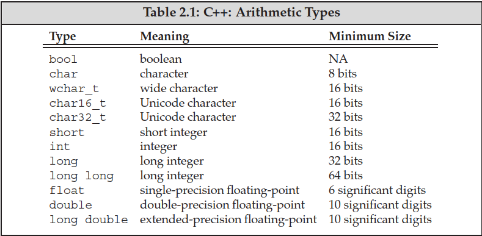

## 2.1 Primitive Built-in Types

### Arithmetic Types



- Machine-level representation:
  - The smallest chunk of addressable memory is a byte.
  - The basic unit of storage is a word.
- The size (largest value) of arithmetic types varies across machines: compilers are allowed to use larger sizes than the minimum required.
- Two categories of arithmetic types: integral and floating-point.
- Character types:
  - `char` is guaranteed to be big enough to hold numeric values corresponding to characters in the machine's basic character set.
  - **`wchar_t`, `char16_t`, `char32_t` are used for extended character sets**: `wchar_t` is large enough for the machine's largest extended character set. `char16_t` and `char32_t` are for Unicode characters.
  - There are three distinct basic character types: `char`, `signed char` and `unsigned char`. **`char` is not necessarily the same as `signed char`**, which may lead to problems across machines.
- Floating-point types:
  - `float`, `double`, `long double` are represented in 1, 2 and 3/4 words.
  - IEEE floating-point standard: sign + biased exponent (8/11 bits) + normalized mantisa (23/52 bits)
    - Biased exponent ($2^{b-1}-1$): you could treat the bits of a floating-point number as a (signed) integer of the same size, and if you compared them that way, **the values will sort into the same order as the floating point numbers they represented**.
    - Normalized mantisa: significant digits in scientific notation.
    - Special values:

| Exponent | Mantisa | Value |
|----------|---------|-------|
| 0        | 0       | 0     |
| 255      | 0       | Infinity |
| 0        | not 0   | Denormalised |
| 255      | not 0   | Not a number (NAN) |


### Type Conversions

- Type conversion behavior:
  - Assigning floating-point values to integral values will involve value truncation (not identical bit pattern). The value stored is the part before the decimal point (not in scientific notation).
  - Precision may be lost when assigning an integral value to a floating-point type (not identical bit pattern).
  - Assigning out-of-range values to unsigned types will involve modulo operation (the same bit pattern).
  - **Assigning out-of-range values to signed types are undefined** (some processors generate a hardware exception on overflow).
      - Avoid undefined/implementation-defined behavior (e.g. assuming the size of `int`).
- Cases of type conversion:
  - The compiler applies type conversions when another arithmetic type is expected.
  - **Signed values are converted to unsigned values if we use both in an arithmetic expression** (not limited to addition/subtraction). Don't mix signed and unsigned types.

### Literals

- Integer literal:
  - Decimal, octal (`0`), hexadecimal (`0x`/`0X`) notation.
    - **The octal and hexadecimal literals have the smallest type of `int`, `unsigned int`, `long`, `unsigned long`, `long long`, or `unsigned long long`. The decimal literals have the smallest type of `int`, `long`, or `long long` (decimal literals are signed by default).** There are no literals of `short`.
    - The type can be explicitly specified with suffixes: `u`/`U` for `unsigned`, `l`/`L` for `long`, and `ll`/`LL` for `long long`. This is specified as the **minimum type** - `l` may be `long long`.
  - **Technically speaking, the value of a decimal literal is never a negative number.**
- Floating-point literal: decimal point (`.`) or an exponent specified using scientific notation (`E` or `e`).
  - Floating-point literals are always `double` by default. **It doesn't depend on the value.**
  - The type can be explicitly specified with suffixes: `f`/`F` for `float`, and `l`/`L` for `long double`.
- Character literal: enclosed in single quotes (`'`).
- String literal: enclosed in double quotes (`"`). The type is **array of constant `char`s (`const char []`)**, where a null character (`'\0'`) will be appended at the end.
  - The type can be explicitly specified with **prefixes**: `u` for `char16_t`, `U` for `char32_t`, `L` for `wchar_t`, `u8` for utf-8 `char` string literals.
  - **Two string literals adjacent to each other separated only by spaces, tabs, or newlines are concatenated into a single literal.**
  - Nonprintable and control characters can be represented using escape sequences. We can also use generalized escape sequences: `\x` followed by hexadecimal digits or `\` followed by octal digits of the character value. **`\` uses only the first three octal digits following it, but `\x` uses up all the hex digits.**

| Character | Escape Sequence |
|------------------|-----------|
| newline          | `\n`     |
| vertical tab     | `\v`     |
| backslash        | `\\`     |
| carriage return  | `\r`     |
| horizontal tab   | `\t`     |
| backspace        | `\b`     |
| question mark    | `\?`     |
| formfeed         | `\f`     |
| alert (bell)     | `\a`     |
| single quote     | `\'`     |
| double quote     | `\"`     |

- Other literals: `true`/`false` (boolean) and `nullptr` (pointer/address).


## 2.2 Variables

### Variable Definitions

- Definition: **base type** specifier followed by a list of **declarators** separated by commas. Each name may have an initial value (initialized, not assigned).
  - The name of each object becomes visible immediately; **it is possible to initialize a variable to the value of one defined earlier.**
- Four ways of initialization:
  - **Loss of information from conversion is not allowed in list initialization.** It can protect us from unintentional narrowing conversions.

```cpp
int units_sold(0);       // direct initialization
int units_sold = 0;      // copy initialization
int units_sold{0};       // list initialization
int units_sold = {0};    // list initialization
```

> Summary of four forms of initialization:
>  - ***The form of initialization is different from how the value is initialized.***
>  - For copy initialization, we can only supply a single initializer - a constructor (not necessarily the copy constructor) will be called with the initializer passed in as the argument.
>    - Copy initialization may be suppressed with `explicit`.
>  - **For in-class initializers, we must either use copy initialization or list initialization (no direct initialization).** See section 2.6 for details.
>  - We can supply a list of values only by using list initialization - **list-initializing will be preferred**.
>    - If such constructors don't exist, it will fall back to direct-initializing with elements as arguments.
>    - **Initializer lists don't require all elements to be of the same type** - they may be used for direct initialization.

- A variable is **default initialized** without an initializer. The value depends on the type and where it is defined:
  - Built-in types: **variables defined outside of functions are zero-initialized**; those defined inside are **uninitialized - undefined**. Uninitialized variables have indeterminate values, which may cause errors hard to debug.
  - Classes: up to the class whether we can define objects without an initializer and what value will it have.


### Variable Declarations and Definitions

- C++ supports separate compilation. In order to share symbols and code across files, declarations and definitions are distinguished:
  - Declaration makes a name known to the program (included to use the name by others).
  - Definition creates the associated entity (**the type should be in line with declaration. The compiler will not necessarily check this**).
- **A variable definition is a declaration** (in contrast to "definition" mentioned above). We need to use **`extern` without an explicit initializer** to obtain a declaration that is not also a definition.
  - **It is an error to provide an initializer on an `extern` inside a function.**
  - To use a variable in more than one file requires declarations separate from definition.

```cpp
extern int x;      // declaration but not a definition
int y = 0;         // declaration and definition
extern int z = 0;  // declaration and definition
```

### Identifiers

- Identifiers can be letters, digits and the underscore. There are no limits on name length. They must begin with a letter or underscore. The names are case-sensitive.
- **C++ keywords and alternative operator names** cannot be used as identifiers.


- **The C++ standard also reserves a set of names for use in libraries**:
  - Identifiers beginning with an underscore followed immediately by an uppercase letter (in any scope).
  - Identifiers containing adjacent underscores (or "double underscore") (in any scope).
  - Identifiers beginning with an underscore (in the global namespace/outside a function).

### Scope of a Name

- Names are visible from the point of declaration until the end of the enclosing scope (block or file/global).
- The scope operator (`::`) can be used to use the name in a specific scope. Since the global scope has no name, **the scope operator with an empty left-hand side refers to the global scope**.
  - It is almost always a bad idea to define a local variable with the same name as a global variable that the function may use.


## 2.3 Compound Types

### References

- A (lvalue) reference defines an alternative name for an object. **A reference must be initialized**: it will be bound to its initializer. **There is no way to rebind a reference.**
  - Since **references are not objects**, we may not define a reference to a reference.
- The type of a reference and the referred object should match exactly with two exceptions: 
  - We can initialize a reference to `const` from **any expression convertible to the type of reference** (section 2.4.1).
  - We can initialize a reference to a base-class type from **an object of a derived-class type** (section 15.2.3).
- **A reference may be bound only to an object**, not to a literal or the result of an expression. Basically, **a non-`const` reference must be bound to an lvalue** (section 4.1).

### Pointers

- A pointer is an object: it can be assigned and copied and need not be initialized.
- We get the address of an object by using the address-of operator (`&`). We may not define a pointer to a reference (not an object).
- The type of a pointer and the pointed object must match with two exceptions: 
  - We can set a pointer to `const` to a **non`const` object** (section 2.4.2).
  - We can set a pointer to a base-class type to **an object of a derived-class type** (section 15.2.3).
- We use the dereference operator (`*`) to access the object pointed to by a pointer, or use the member access operator (`->`) if the pointer points to a non-built-in object.
- Null pointers: **`nullptr` (a special type convertible to any pointer type)**, `0`/`NULL` (avoided in modern C++ programs).
- Pointers can be used in conditions (non-zero pointers evaluate to `true`) or comparison operations (`==`/`!=`).
  - **It is possible for a pointer to an object and a pointer one past the end of a different object to hold the same address.**
- `void *` pointers can hold the address of **any data pointer type** (cast automatically when assigned), but we cannot dereference a `void *` pointer without an explicit cast. We use them to deal with memory as memory instead of accessing objects.

### Understanding Compound Type Declarations

- There are no limits to how many type modifiers (`&`/`*`) can be applied to a declarator.
- Reference to a pointer: `int *&r = p` (read from right to left).


## 2.4 `const` Qualifier

### Declaration and Definition

- `const` object values cannot be changed after initialization. They must be initialized at the point of declaration.
  - When we use an object to (copy) initialize another object, it doesn't matter whether either or both are `const` objects.
- **`const` variable definitions are local to a file. The compiler handles `const` variables differently from ordinary ones**:
  - `const` objects initialized from a compile-time constant will be replaced with its corresponding value during compilation.
  - `const` objects initialized from a non-constant expression will remain as objects (variables). They are local to the file: no multi-definition compilation errors.
- In order to reuse a `const` variable across files, we can define a single instance of it by **using `extern` on both the definition and declarations**:
  - In contrast, `extern` is only needed on the declaration for non-`const` variables.

```cpp
// file.cpp
extern const int bufSize = fcn();  // !!! extern makes it visible in other files

// file.h
extern const int bufSize;
```

### References to `const`

- "Reference to `const`" is abbreviated as "`const` reference". **There are no `const` references** - a reference is not an object.
- We can initialize a reference to `const` from **any expression convertible to the type of reference - non-`const` object, literal or general expression**. Basically, **we can bind a `const` reference to a rvalue (section 4.1)**.
  - In this way, a **temporary object** is created by the compiler to store the result of the expression, and is bound by the reference.
  - The underlying object might be non-`const` and be changed by other means.

```cpp
int i = 42;
const int &r1 = i;        // ok: plain int object 
const int &r2 = 42;       // ok: literal
const int &r3 = r1 * 2;   // ok: general expression that evaluates to int
int &r4 = r1 * 2;         // error: r4 is a plain, non-const reference

double dval = 3.14; 
const int &ri = dval;     // ok: bound to a temporary object - int 3
```

### Pointers and `const`

- A **pointer to `const`** may not be used to change the pointed object. We may store the address of a `const` object only in a pointer to `const`.
  - Like references, pointers to `const` can be bound to non-`const` objects.
- **`const` pointers** have unchangeable address values: put the `const` after the `*` (`int *const`) - read from right to left.

### Top-Level `const`

- **Top-level `const`**: the pointer (object) itself is `const`; **low-level `const`**: referring/pointing to a `const` object.
- When we copy an object, **top-level `const`s (of the copied object) are ignored** - copying doesn't change the copied object, but **low-level `const` (of the copied object) is never ignored**.

```cpp
int i = 0;
int *const p1 = &i;        // top-level
const int ci = 42;         // top-level
const int *p2 = &ci;       // low-level
const int *const p3 = p2;  // top-level + low-level

int *p = p3;        // error: p3 has a low-level const but p doesn’t
p2 = p3;            // ok: p2 has the same low-level const qualification as p3 
p2 = &i;            // ok: we can convert int* to const int*
int &r = ci;        // error: can’t bind an ordinary int& to a const int object 
const int &r2 = i;  // ok: can bind const int& to plain int
```

### `constexpr` and Constant Expressions

- A **constant expression** is an expression whose value cannot change and can be evaluated at compile time: **literals, `const` objects initialized from constant expressions**, etc.
- We might define a `const` variable with an initializer that we think is a constant expression. However, when we use that variable in a context that requires a constant expression we may discover that the initializer was not a constant expression. In order to avoid this, we can **use `constexpr` declaration to ask the compiler to verify whether a variable is a constant expression**.
  - ***Warning: `constexpr` is different from constant expressions - `constexpr` is only a way to verify whether it is a constant expression.***
  - **`constexpr` implicitly implies `const`.**

```cpp
constexpr int mf = 20;         // 20 is a constant expression
constexpr int limit = mf + 1;  // mf + 1 is a constant expression
constexpr int sz = size();     // ok only if size is a constexpr function
```

- The types can be used as `constexpr` are known as **literal types**: arithmetic, reference, pointer, etc.
- `constexpr` pointers can be initialized with objects on the heap (defined outside functions or static) but not with objects on the stack.
- **`constexpr` specifier always applies to the pointer**, not the type to which the pointer points.

```cpp
const int *p = nullptr;      // p is a pointer to a const int - low-level
constexpr int *q = nullptr;  // q is a const pointer to int - top-level

constexpr int i = 42;
int j = 0;
constexpr const int *p = &i; // p is a constant pointer to the const int i
constexpr int *p1 = &j;      // p1 is a constant pointer to the int j
```


## 2.5 Dealing with Types


### Type Aliases

- Two ways of defining a type alias - `typedef` and `using`:

```cpp
typedef double wages;    // wages is a synonym for double
typedef wages base, *p;  // base is a synonym for double, p for double*

using SI = Sales_item; // SI is a synonym for Sales_item
```

- However, there are pitfalls to be aware of: compound types are viewed as a whole and cannot be simply replaced with the underlying types:

```cpp
typedef char *pstring;
const pstring cstr = 0;  // cstr is a constant pointer to char
const char *cstr = 0;    // wrong interpretation of const pstring cstr
const pstring *ps;       // ps is a pointer to a constant pointer to char
```

### The `auto` Type Specifier

- `auto` tells the compiler to deduce the type from the initializer (must have one). Multiple variables defined with a single `auto` should have consistent types.
  - No implicit type conversion: `auto sz = 0, pi = 3.14` is not allowed.
- When we use a reference as an initializer, the compiler uses the referenced object's type for `auto`'s type deduction.
- `const`-related type deduction:
  - Top-level `const` will be ignored by `auto` during type deduction.
  - However, **when we ask for a reference to an `auto`-deduced type, top-level `const`s in the initializer are not ignored** - the defined reference will have low-level `const`.
  - **For temporary objects as initializers (literals/expressions), no top-level `const` is implied, and the deduced type will be non-const.** Therefore, `const` is necessary when binding a reference to a temporary object.

```cpp
// Top-level const
int i = 0;
const int ci = i;
auto b = ci;        // int
auto e = &ci;       // const int * (low-level)
const auto f = ci;  // const int (top-level)

// References
auto &g = ci;       // const int & (top-level const is preserved when using auto with a reference)
const auto &h = ci; // const int & (const is not necessary here)
auto &j = 42;       // not allowed (literal - no top-level const; deduced type is int)
const auto &j = 42; // const int &

// Type consistency
auto k = ci, &l = i;     // k is int; l is int&
auto &m = ci, *p = &ci;  // m is const int&; p is a pointer to const int
auto &n = i, *p2 = &ci;  // error: type deduced from i is int; type deduced from &ci is const int
```


### The `decltype` Type Specifier

- `decltype(...)` is used to let the compiler **analyze the expression to determine the type without evaluating the expressions**.
- `const` and reference-related type deduction:
  - When the expression is a variable, then **the exact type** including top-level `const` and reference is returned. *This is the only context where a reference variable is not treated as a synonym for the referred object.*
  - For other expressions, **the result is a reference type if the expression yields an lvalue** (section 4.1.1), e.g. dereference.
    - This leads to some interesting behaviors. **If we wrap a variable in one or more sets of parentheses, it becomes an expression that yields an lvalue, so `decltype` will return a reference type.**

```cpp
int i = 42, *p = &i, &r = i;
decltype(r) a = i;   // a is int &
decltype(r + 0) b;   // b is int: a trick to get the referred type
decltype(*p) c = i;  // c is int &
decltype((i)) d = i; // d is int &
decltype(i) e;       // e is int
decltype(i = 45) f;  // f is int &: i = 45 will not be executed - only for type deduction
```


## 2.6 Defining Our Own Data Structures

### Defining the `Sales_data` Type

- The close curly that ends the class/struct body must be followed by a semicolon. It is needed because we can define variables after the class body: `struct Sales_data { /* ... */ } accum, trans, *salesptr;`.
  - It is not recommended though: it obscures the code by combining the definition of two different entities.
- Under C++11, we can supply **in-class initializers** for data members if we don't want them default initialized. **They must either be enclosed inside curly braces or follow an `=` sign.**

### Writing Our Own Header Files

- Classes are usually defined in header files to ensure the definition is the same in each file. Headers contain entities that can be defined only once in any given file, but since it might be included more than once, we need to write headers that is safe even if it is included multiple times.
- **The preprocessor is a program that runs before the compiler and changes the source text of programs.**
  - `#include`: It will be replaced with the contents of the specified header.
  - Preprocessor variables (`#define`, `#ifdef`, `#ifndef`, `#endif`) are used to define **header guards**. We typically ensure uniqueness by basing the guard's name on the name of a class.
