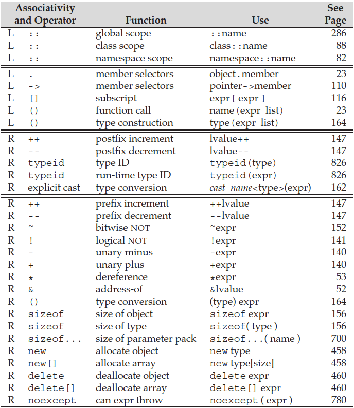
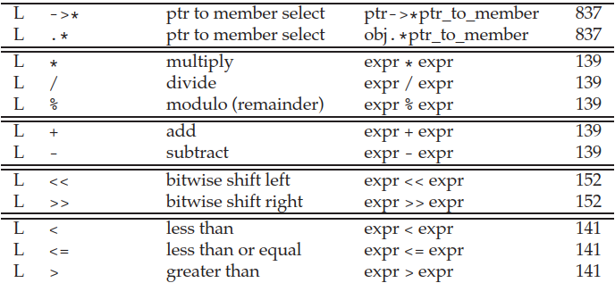
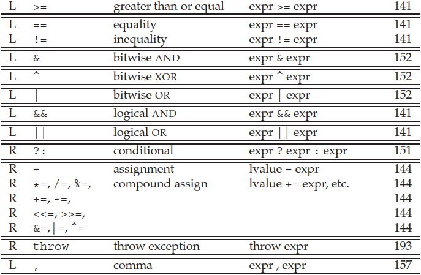

## 4.1 Fundamentals

### Basic Concepts

- When we overload an operator, the meaning of it - including the type of operands and the result - depends on how it is defined. However, **the number of operands and the precedence and associativity cannot be changed**.
- Every expression in C++ is either an **rvalue** or an **lvalue**. When we use an object as an rvalue, we use the object's value. When we use an object as an lvalue, we use the object's identity (location in memory).
  - **We can use an lvalue when an rvalue is required, but we cannot use an rvalue when an lvalue is required.**
  - **`const` variables are still lvalues** - some operators (e.g. assignment) requires a non-`const` lvalue as the left-hand operand.
- When we apply `decltype` to an expression, **the result is a reference type iff the expression yields an lvalue**.

### Precedence and Associativity

- Operands of operators with higher **precedence** group more tightly than operands of operators at lower precedence. **Associativity** determines how to group operands with the same precedence.





- Notes:
  - For `noexcept` operator (not function specifier), refer to section 18.1.
  - For `typeid`, refer to section 19.2.
  - For pointer to member operators (`.*`, `->*`), refer to section 19.4.


### Order of Evaluation

- **Precedence and associativity say nothing about the order in which operands are evaluated.**
- For operators that do not specify evaluation order, **it is an error for an expression to refer to and change the same object** - undefined behavior.
  - Four exceptions: logical AND `&&`, logical OR `||`, **conditional `? :`, comma `,`**.

```cpp
cout << i << " " << ++i << endl;  // error
f() + g() * h() + j();            // error if some functions affect the same object
```


## 4.2 Arithmetic Operators

- Unary arithmetic operators (`+`, `-`) have higher precedence than multiplication and division operators (`*`, `/`, `%`), which have higher precedence than binary addition and subtraction operators (`+`, `-`). They are all left associative.
- **The operands and results of these operators are rvalues.**
- Operands of small integral types are promoted, and both operands may be converted to a common type (section 4.11). **Type promotions happen when an operator is evaluated.**
  - **Any integer type smaller than `int` will always be promoted to at least `int`/`unsigned int` (section 4.11).**
- Note: `bool` values should not be used for computation.

```cpp
bool b = true;
bool b2 = -b;  // b2 is true: promoted to int 1, negated to -1, converted back to bool
```

- Meaning of operators:
  - `/` computes the quotient. **The quotient is rounded toward zero in C++11 standard.**
    - `(-m)/n` and `m/(-n)` are always equal to `-(m/n)`.
  - `%` computes the remainder. The operands to `%` must have integral type. If `n` is nonzero, then **`(m/n)*n + m%n == m`: `m%n` has the same sign as `m`**.
    - `m%(-n)` is always equal to `m%n`, and `(-m)%n` is always equal to `-(m%n)`.


## 4.3 Logical and Relational Operators

- The logical operators take operands of any type that can be converted to `bool`. Except for `!`, all of them are left associative.
- **The operands and result are rvalues.**
- Short-circuit evaluation: in `&&` and `||`, the right operand is evaluated iff the left operand does not determine the result.
- Relational operators cannot be chained together: in `a < b < c`, a boolean is compared with `c`.


## 4.4 Assignment Operators

- **Assignment operators are right associative.** Assignment has relatively low precedence.
- The left-hand operand must be a modifiable lvalue (non-`const` variable for assignment, declaration for initialization), and the result is an lvalue referring to the left-hand operand.
- **Under C++11, we can use a braced initializer list for assignment.**
  - For built-in types, at most one value can be contained.
  - For class types, the following choices are available:
    - For aggregate classes (section 7.5), each field in the initializer list is copied to the corresponding member of the object.
    - The assignment operator taking an initializer list will be called if it exists.
    - If no such operator exists, the compiler will attempt to use a constructor: the constructor that takes an initializer list will be called if it exists; otherwise, the compiler will try to find a constructor that matches the number and types of the elements in the initializer list.
  - For any type, the initializer list can be empty: **a value-initialized temporary is generated and assigned to the left-hand operand.**

```cpp
class Base {
 public:
  Base(int i, int j);                    // 3rd choice
  Base(initializer_list<int> lst);       // 2nd choice
  operator=(initializer_list<int> lst);  // 1st choice
  operator=(int i, int j);  // error: assignment operator must take exactly one parameter
}
```

- When we use the compound assignment (e.g. `+=`), the left-hand operand is evaluated only once. If we use an ordinary assignment, the left-hand operand is evaluated twice.


## 4.5 Increment and Decrement Operators

- Increment operators require lvalue operands. The prefix operators return the object itself as an lvalue, while the postfix operators return a copy of the object's original value as an rvalue.
  - **Advice: use postfix operators only when necessary.** The prefix version avoids unnecessary work.
- `*ptr++` is a widely used idiom: it is equivalent to `*(ptr++)`.
- **Avoid misusing these operators in compound expressions where their order of evaluation is important.**

```cpp
*ptr = toupper(*ptr++);              // undefined: order of evaluation is unspecified

*ptr = toupper(*ptr); ptr++;         // if left-hand side is evaluated first
*(ptr + 1) = toupper(*ptr); ptr++;   // if right-hand side is evaluated first
```


## 4.6 The Member Access Operators

- The member access operators (`.`, `->`) have very high precedence (higher than increment/decrement and dereference).
- The arrow operator requires a pointer (rvalue) operand and yields an lvalue. **The dot operator yields an lvalue iff its left operand is an lvalue.**
- The arrow operator actually returns a pointer to an object. Refer to section 14.7 for more details.


## 4.7 The Conditional Operator

- The two expressions in the conditional operator must have the same type, or types convertible to a common type.
- **The expressions are not evaluated until the operator is evaluated, and only one of them is evaluated.**
- **The result is an lvalue iff both expressions are lvalues or both are convertible to a common lvalue type.**
- Conditional operators can be nested without parentheses: they are right associative.
- Conditional operators have fairly low precedence: parenthesize them when used in expressions with other operators.


## 4.8 The Bitwise Operators

- The bitwise operators take operands of integral type or `bitset` (section 17.2) to test and set individual bits.
  - **Any integer type smaller than `int` will always be promoted to at least `int`/`unsigned int` (section 4.11).**
  - Both signed and unsigned types are allowed. However, operating on signed types with negative values is machine dependent (except for left shift) - use unsigned types instead.
- For bitwise shift operators, the right-hand operand must not be negative and must be less than the number of bits in the left-hand operand. Otherwise, the operation is undefined.
  - The right-shift operator inserts zeros on the left for unsigned types (logical right shift). **For signed types, the result is implementation defined (arithmetic or logical right shift).**
- Bitwise shift (aka IO) operators are left associative and have midlevel precedence: lower than arithmetic operators but higher than relational operators.

```cpp
cout << 10 + 42;    // ok
cout << (10 < 42);  // ok
cout << 10 < 42;    // error: (cout << 10) < 42
```


## 4.9 The `sizeof` Operator

- The `sizeof` operator returns a **constant expression** of type `size_t`. It takes one of two forms: `sizeof expr` or `sizeof (type)`.
- **The `sizeof` operator does not evaluate its operand.**
- Under C++11 standard, we can use the scope operator to ask for the size of a class member without an object: `sizeof ClassName::member`.
- `sizeof` an array is the size of the entire array. It doesn't convert the array to a pointer.
- **`sizeof` a `string` or `vector` returns only the size of the fixed part (no dynamic allocated elements).**


## 4.10 Comma Operator

- The left-hand expression is evaluated but its result is discarded. The right-hand expression is evaluated and its result is returned.
- **The result is an lvalue iff the right-hand expression is an lvalue.**


## 4.11 Type Conversions

- Two types are related if there is a conversion between them. We can use an object or value of one type where an operand of the related type is expected - **implicit conversion** will be performed by the compiler.
  - The implicit conversions among arithmetic (built-in) types are defined to preserve precision.
- When Implicit conversions occur:
  - In most expressions, **values of integral types smaller than `int` are first promoted to an appropriate larger integral type**.
  - In conditions, non-`bool` values are converted to `bool`.
  - In initializations/assignments, the initializer/right-hand operand is converted to the type of the variable (left-hand operand).
  - In arithmetic and relational expressions, the operands are converted to a common type.
  - In function calls, the arguments are converted to the types of the corresponding parameters.


### The Arithmetic Conversions

- **The integral promotions happen first.** They ***always*** convert small integral types to a larger integral type. Only the size matters:
  - The types `bool`, `char`, `signed char`, `unsigned char`, `short`, and `unsigned short` are promoted to `int` if **all values in that type** fit in an `int` (**not related to the actual value; not related to whether signed or not**). Otherwise, the value is promoted to `unsigned int`.
  - Larger `char` types (`wchar_t`, `char16_t`, `char32_t`) are promoted to the smallest type of `int`, `unsigned int`, `long`, `unsigned long`, `long long`, or `unsigned long long` that can hold all the values of the original type.
- Afterwards, if **the operands have different signedness**:
  - If the unsigned type (`unsigned int`) is the same as or larger than the signed type (`int`), the signed type is converted to the unsigned type.
  - Otherwise, the result is machine dependent: if **all values in the unsigned type** fit in the signed type (**not related to the actual value**), then the unsigned operand is converted to the signed type; otherwise, the signed operand is converted to the unsigned type.
    - Example: `long` and `unsigned int`. If `long` and `int` have the same size, then `long` will be converted to `unsigned int`. If `long` has more bits, then `unsigned int` will be converted to `long`.
- In expressions **mixing floating-point and integral types**, the integral type is always converted to the (larger) floating-point type. Precision is not prioritized.
  - Example: `float` and `long long` - `long long` is converted to `float`.

```cpp
bool flag;    char cval;
short sval;   unsigned short usval; 
int ival;     unsigned int uival; 
long lval;    unsigned long ulval; 
float fval;   double dval;

3.14159L + 'a';  // 'a' promoted to int, then that int converted to long double

cval + fval;     // cval promoted to int, then that int converted to float
sval + cval;     // sval and cval promoted to int

usval + ival;    // promotion depends on the size of unsigned short and int
uival + lval;    // conversion depends on the size of unsigned int and long
```


### Other Implicit Conversions

- Array to pointer conversions are not performed when an array is used with `decltype` or as the operand of `&`, `sizeof`, or `typeid` (section 19.2), or when we initialize a reference with it.
- Pointer conversions:
  - **A constant integral value of 0 and the literal `nullptr` can be converted to any pointer type.**
  - A pointer to any non-`const` type can be converted to `void *`, and a pointer to any type can be converted to `const void *`.
  - A base-class pointer (or reference) can be bound to a derived-class object (section 15.2).
- Conversions to `bool`: compare to zero for arithmetic types, compare to `nullptr` for pointers, and call conversion to `bool` (`operator bool() const`) for class types.
- A pointer to a non-`const` type can be converted to low-level `const` pointer type. The reverse conversion does not apply.

### Explicit Conversions

> Casts are inherently dangerous constructs.

- Named casts:
  - `static_cast` (value conversion, **allow potential loss of precision**): not only built-in types, but also **class types (using conversion functions or constructors, e.g. `string`)** are supported.
  - `dynamic_cast` (run-time type identification used in polymorphism, section 19.2)
  - `const_cast` (cast away/add **low-level `const`** - but writing to a `const` object is undefined)
  - `reinterpret_cast` (low-level reinterpretation of the bit pattern, **dangerous**): **only pointer-pointer, reference-reference, and pointer-integer conversions are allowed.**
- Old-style casts (`type (expr)`, `(type) expr`) does the same conversion as one of these: try `static_cast` and `const_cast`, and then `reinterpret_cast`.
