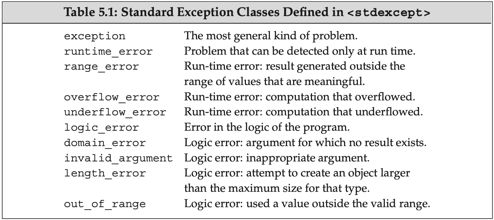

## 5.1 Simple Statements

- An expression becomes an expression statement when it is followed by a semicolon. The result of the expression is discarded.
- The empty/null statement is a single semicolon. It is useful when a statement is required syntactically but no action is needed. **They should be commented to indicate it is intentional.**
- A compound statement (block) is a sequence of statements and declarations surrounded by a pair of curly braces. It is treated as a single statement. A block is not terminated by a semicolon.
  - A block is a scope (section 2.2).
  - An empty block is equivalent to a null statement.

## 5.2 Statement Scope

- **We can define variables inside the control structure (condition) of `if`, `switch`, `while` and `for` statements.** They are visible only within that statement.
  - **Only one variable can be defined, and it must be initialized.** The variable is created and destroyed on each iteration.

```cpp
while (int i = get_num())
	cout << i << endl;       // i is valid here
cout << i << endl;           // error: i is not valid here
```

## 5.3 Conditional Statements

### The `if` Statement

- Two forms of `if`: `if (condition) statement` and `if (condition) statement else statement`.
- Dangling `else`: each `else` is matched with the closest preceding unmatched `if`.
- To avoid ambiguity, we should always use braces for `if` statements.

### The `switch` Statement

- **The expression in the `switch` statement is converted to integral type**, and the result is compared with the value associated with each `case`.
- `break` transfers control out of the `switch`. If we omit `break`, the program will fall through the next `case` label.
  - It is recommended to include a comment explaining the fall through.
  - Include a `break` after the last label of a `switch`. If an additional `case` is added later, the `break` is already in place.
- **`case` labels must be integral constant expressions.** It is an error for any two `case` labels to have the same value.
- The statements following the `default` label are executed if no `case` label matches the value.
  - Always define a `default` label: it indicates that the case is considered.
- **A label may not stand alone; it must precede a statement or another `case` label.**

```cpp
switch (n) {
    case 1:
        do_something();
    default: ;           // null statement
}
```

- It is illegal to jump from a place where a variable with an initializer is out of scope to a place where that variable is in scope. **If we need to define and initialize a variable for a particular `case`, we can define the variable inside a block.**
  - **If the variable is not initialized, using it in another `case` is legal.**

```cpp
switch (n) {
    case 1:
        int x;        // no initializer
        x = 10;
        break;
    case 2:
        x = 20;       // ok: x is still in scope here
        break;
}
```


## 5.4 Iterative Statements

### The `while` Statement

- A `while` loop is generally used when we want to iterate indefinitely.

### Traditional `for` Statement

- The `init-statement` can define several objects, but it may be only a single declaration statement - all variables of the same base type.
- Any or all of `init-statement`, `condition`, or `expression` can be omitted.

### Range `for` Statement

- C++11 introduced a simpler `for` statement for iterating through elements of an array/sequence (with iterators): `for (declaration : expression) statement`.
  - **The expression can be a braced initializer list.**
  - Range `for` can be viewed as iterating using iterators returned by `std::begin()` and `std::end()` (more details in section 9.3).

### The `do while` Statement

- The `do while` loop does not allow variable definitions inside the condition - it is not evaluated until after the statement is executed.
- **Every statement ends with a semicolon or a block** - this is why a semicolon is required after the parenthesized condition.


## 5.5 Jump Statements

### The `break` Statement

- A `break` statement terminates the nearest enclosing `while`, `do while`, `for`, or `switch` statement.

### The `continue` Statement

- A `continue` statement terminates the current iteration of the nearest enclosing `while`, `do while`, `for`, or `switch` statement and immediately begins the next iteration.
  - In a traditional `for` loop, execution continues at the `expression` inside the header.

### The `goto` Statement

- Do not use `goto`s - they make programs hard to understand and modify.
- `goto label;` jumps to a **labeled statement** (any statement preceded by an identifier followed by a colon).
  - **A label may have the same identifier as another entity in the program without interference.**
- Control transfer limitations:
  - The `goto` and the labeled statement must be **in the same function**.
  - We cannot transfer control from a point where an **initialized** variable is out of scope to a point where that variable is in scope. **However, backward jumping over an initialized variable definition is okay (the previous variable will be destroyed and constructed again).**

```cpp
    goto end;     // error: bypass initialized ix
    int ix = 10;
end:
    ix = 42;

begin:
    int ix = 10;
    goto begin;   // ok: define and initialize ix again
```


## 5.6 `try` Blocks and Exception Handling

- **Exceptions** are run-time anomalies that exist outside the normal functioning of a program. When one part of a program **detects** a problem it cannot solve, it signals it using exceptions without knowing what part of the program will deal with that, and stop processing. Another part of the program **handles** whatever happened (exception handler).

### A `throw` Expression

- `throw` expressions raise exceptions: `throw expression`. **The expression can be of any type - even an integer.**
- **A single `throw;` forwards the currently handled exception to the its external level.**

### The `try` Block

- A `try` block begins with `try` followed by a block. Following it is a list of one or more `catch` clauses. Each `catch` consists of three parts: `catch`, **exception declaration**, and a block.
    - **Exception declaration can be a lvalue reference**, which avoids extra copy/move. Unlike function return values, non-`const` references are also supported - **the exception object lives in special storage and behaves like an lvalue**. rvalue references are not allowed.
    - An ellipsis (`...`) can be used to catch any exception type.

```cpp
try {
    statements
} catch (exception-declaration) {
    handler-statements
} catch (exception-declaration) {
    handler-statements
} // ...
```

- The search for a handler reverses the call chain. If no appropriate `catch` is found, execution is transferred to a library function `terminate` to stop the program.
- Whether a handler is a match is determined by:
  - The same type as the thrown object.
  - The base class of the thrown object (cautious about polymorphism: pointers/references and virtual member functions should be used).
  - **Standard pointer conversions (e.g. array, function, `void *`/`const void *`) (section 4.11).**
- **Exception safe** code is hard to write: we must ensure that invalid/incomplete objects and states (resulting from bypassing part of the program) need to be properly cleaned up.


### Standard Exceptions

- The C++ standard library provides several classes of exceptions:
  - `exception` defines the base class `std::exception`.
  - `stdexcept` defines several general-purpose exception classes we can use.
  - `new` defines `std::bad_alloc` (section 12.1).
  - `type_info` defines `std::bad_cast` (section 19.2).
- `exception`, `bad_alloc`, and `bad_cast` can only be default initialized. **Other exception types can only be initialized with a `string` or a C-style string**, which is returned by the `what` member function.


