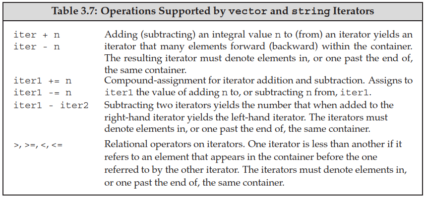

# Chapter 3 Strings, Vectors, and Arrays

## 3.1 Namespace `using` Declarations

- A `using` declaration lets us use a name without qualifying the name with a namespace prefix: `using namespace::name`.
  - It is still ok to explicitly use the namespace afterwards.
  - Each `using` declaration can only introduce one name.
- **Headers should not include `using` declarations**. If a header has a `using` declaration, than every program that includes that header gets the same `using` declaration, which may not be intended.

## 3.2 Library `string` Type

- The header `string` must be included; `string` is defined in the `std` namespace.

### Defining and Initializing `string`s

- String literals are arrays of `const char`s, so initializing from a string literal is actually initializing from a character array.

```cpp
// Empty string
string s1;            // default initialization

// From another string
string s2(s1);        // direct initialization
string s2 = s1;       // copy initialization

// From a string literal (basically the same as from a character array)
string s3("value");   // direct initialization
string s3 = "value";  // copy initialization

// From a single character
string s4(n, 'c');    // direct initialization only (two values)

// From a character array (C-style string)
char arr[] = "value";
string s5(arr);       // direct initialization (null-terminated only)
string s5 = arr;      // copy initialization (null-terminated only)
string s5(arr, 3);    // direct initialization only (specific length)
```

### Operations on `string`s


- Strings are mutable in C++, unlike Python or Java.
- Reading and writing a string:
  - `getline(is, s)` reads the given stream up to and including the first newline, and stores it **not including the newline** in the string argument. Like the input operator, `getline` returns the `istream` argument.
- Basic operations:
  - `s.size()` returns a `string::size_type` value (an **unsigned type** big enough to hold any size). **Use `auto`/`decltype(s.size())` to define variables for storing the size.**
    - **These companion types make it possible to use the library types in a machine-independent manner.**
    - Be careful of expressions that mix signed and unsigned (size) data.
  - Strings are compared using the same strategy as a case-sensitive dictionary.
  - Adding two strings yields the concatenation of both strings.
- Type conversion:
  - The `string` library lets us (implicitly) convert both character literals and string literals to `string` objects. Therefore, we can use them where a `string` is expected. However, we need to be sure that **at least one operand to each `+` operator must be of `string` type** to trigger such type conversion.

```cpp
string s1 = "hello", s2 = "world";
string s3 = s1 + ", " + s2 + '\n';
string s4 = s1 + ", ";              // ok: adding a string and a literal
string s5 = "hello" + ", ";         // error: no string operand
string s6 = s1 + ", " + "world";    // ok: each + has a string operand (left to right)
string s7 = "hello" + ", " + s2;    // error: can't add string literals
```

### Dealing with the Characters in a `string`

- Functions for handling the characteristics of a character (defined in `cctype`):


- To access individual characters, we can use a subscript operator (`[]`, takes a `string::size_type` value) or an iterator (section 3.4).
  - Indexing outside of the string's bounds will **not** be checked and is undefined behavior.
- Range-based `for` iterates through the elements in a given sequence and performs some operation (read or change) on each value:

```cpp
for (declaration : expression) {
    statement
}

// Note: for const strings, each element is a reference to const char (section 2.5)
const string s = "xxx";
for (auto &c : s) {  // Here c is of type const char &
    // process character c
}
```


## 3.3 Library `vector` Type

- A `vector` is a **class template**. Class templates can be thought of as instructions to the compiler for generating classes or funcitions - instantiation.
- We can define `vector`s to hold objects of most types. **Since references are not objects, we cannot have `vector`s of references.**
    - Some compilers may require old-style declarations for `vector<vector<int> >`.

### Defining and Initializing `vector`s

- [**Value initialization**](https://en.cppreference.com/w/cpp/language/value_initialization.html): if an object is constructed with an empty initializer, value initialization is performed.
    - **Examples of value initialization: `T()`, `T obj{}`, `T{}`.** Default initialization only applies for `T obj` and `T obj[]` (no initializer is provided). *Check section 7.5.3 (The Role of the Default Constructor) for more details.*
    - If `T` has user-defined default constructor, then it is default-initialized (using the constructor).
        - **If `T` has a deleted default constructor, value (default) initialization will fail.**
    - Otherwise, if `T` is an array type, each element of the array is value-initialized.
    - Otherwise, the object is zero-initialized (e.g. built-in types).
- We must use direct initialization to supply a size. How this is enforced (`explicit`) is described in section 7.5.4.
- **If list initialization is used to construct a `vector`, the compiler will attempt to list-initialize it first and then fall back to direct-initializating the `vector`.**

```cpp
// Empty vector
vector<T> v1;                // default initialization

// From another vector
vector<T> v2(v1);            // direct initialization
vector<T> v2 = v1;           // copy initialization

// From size & element value
vector<T> v3(n, val);        // direct initialization only: n elements with value val
vector<T> v4(n);             // direct initialization only: n value-initialized elements
// vector<T> v4 = n;         // error

// List initializer
vector<T> v5{a, b, ...};     // list initialization (without =)
vector<T> v5 = {a, b, ...};  // list initialization (with =)
vector<T> v6{n};             // not expected behavior: direct initializing the vector with a size
```

### Adding Elements to a `vector`

- Because `vector`s grow efficiently, **it is often unnecessary - and can result in poorer performance - to define a `vector` of a specific size.** The only exception is if all elements are of the same value.
- **We cannot use a range `for` if the body of the loop adds elements to or erase elements from the `vector`.**
    - Range `for` will get the iterators at the start; **if the vector grows (is reallocated), the iterators will be invalidated**. See section 5.4.3 for details.
    - Alternative: use the return iterator of `insert()` and `erase()` to move to the next element.

### Other `vector` Operations

- `size` returns a value of the `size_type` defined by the corresponding `vector` type: `vector<T>::size_type`.
- The equality and relational operators work the same as `string` operations: dictionary ordering.
    - We can compare two `vector`s only if we can compare the element in those `vector`s.
- Subscripting an element that doesn't exist is an error that compilers are unlikely to detect. So-called buffer overflow errors are the result of this.


## 3.4 Introducing Iterators

- All of the library containers have iterators, but only a few of them support the subscript operator.
- **A valid iterator either denotes an element or a position one past the last element in a container.** All other iterator values are invalid - dereferencing or incrementing an invalid iterator (or an off-the-end iterator) has undefined behavior.

### Using Iterators

- Types with iterators have members `begin()` and `end()` to return iterators for the first or the one-past-the-end (off-the-end iterator) element.
- Iterators can be dereferenced using `*` and `->` operators similar to pointers.
- Moving an iterator by one element: `++iter` or `iter++` (next), `--iter` or `iter--` (previous).
  - Some stream iterators can only be incremented.
- We should compare two valid iterators using `==` or `!=`: most iterator types have no relational operators (`<`, `>`, `<=`, `>=`).
- The library types with iterators define types named `iterator` and `const_iterator`: `const_iterator` behaves like a pointer to `const` *(ambiguity in original text here)*.
  - **If the container (or `string`) is `const`, then we may only its `const_iterator` type: `begin()` and `end()` return `const_iterator`.**
  - Otherwise, we may call `cbegin()` and `cend()` to get `const_iterator`s.


### Iterator Arithmetic

- Only **random-access iterators** (e.g. `vector` and `string`) support iterator arithmetic.
- Subtracting two iterators yields the number of elements between them in the signed type `difference_type` defined by the container.
- Classic example of iterator arithmetic usage: binary search.
  - **Jumping to the middle of a sequence: `mid = beg + (end - beg) / 2;`**.




## 3.5 Arrays

### Defining and Initializing Built-in Arrays

- **The number of elements in an array is part of the array's type.** As a result, the dimension must be known at compile time - it must be a **constant expression**.
  - **We cannot use `auto` to deduce the type from an initializer list.**
  - When using GCC/Clang, `-std=c++11 -pedantic` need to be specified to enforce this rule.

```cpp
unsigned cnt = 42;            // not a constant expression 
constexpr unsigned sz = 42;   // constant expression
const unsigned sz2 = 10;      // constant variable initialized from a literal: also a constant expression

int arr[10];                  // ok: literal
int *parr[sz];                // ok: constant expression
string bad[cnt];              // error: not a constant expression
string strs[get_size()];      // ok if get_size is constexpr, error otherwise
```

- Arrays hold objects, so there are no arrays of references.
- Array initialization:
  - **We cannot copy or assign arrays.**
  - When using list initialization, the dimension can be omitted and inferred from the initializer list. If it is specified, it must be at least as long as the initializer list.
  - Character arrays are special: we can initialize them from string literals. The null character is copied into the array along with the characters in the literal.
- Element initialization:
  - By default (no initialization list), the elements in an array are default initialized.
  - If the dimension is greater than the number of initializers, **the remaining elements are value-initialized**. **The initializer list can be empty (`{}`) to value-initialize all elements.**
- The type declaration can be read from right to left, from inside out.

```cpp
int *ptrs[10];             // ptrs is an array of ten pointers to int 
int (*Parray)[10] = &arr;  // Parray points to an array of ten ints 
int (&arrRef)[10] = arr;   // arrRef refers to an array of ten ints
```

### Accessing the Elements of an Array

- Accessing via subscription: define the index as `size_t` (defined in `cstddef`).
  - The subscript operator is the built-in version (not library-defined as in `vector`) - **it does not force the index to be unsigned**.
- **It is best to use a range `for` to traverse the entire array.** Because the dimension is part of the array type, the system knows the number of elements in the array.

### Pointers and Arrays

- Arrays have a special property - in most places when we use an array, the compiler automatically substitiutes a pointer to the first element of the array (e.g. subscription).
  - **Using `auto` with an array will yield a pointer type. However, `decltype` will yield the array type with equal length** - length is part of the type.
- Pointers are iterators: we can write a loop using a pointer to the first element and an off-the-end pointer.
  - **`iterator` has two functions `begin()` and `end()`** that return pointers to the first and one-past-the-end elements of an array.
- Pointer arithmetic:
  - Adding/Subtracting an integer to/from a pointer moves the pointer by that many elements.
  - **Subtracting two pointers gives us the distance between pointers in a signed type `ptrdiff_t` (defined in `cstddef`).**
  - Relational operators can be used on pointers to elements in the same array; undefined behavior otherwise.
  - Limited pointer arithmetic is also valid for null pointers and individual objects.
- We can use the subscript operator on pointers. **Negative values are allowed.**


### C-Style Character Strings

- Character string literals are C-style character strings stored in character arrays and are null-terminated.
- The standard C library provides a set of functions on C-style strings (defined in `cstring`).


### Interfacing to Older Code

- `string`s and C-style strings:
  - We can use a null-terminated character array anywhere that we can use a string literal: initializing a `string` or `string` concatenation (`+`).
  - `string::c_str()` returns a pointer to a null-terminated character array that contains the same sequence of characters as the string object. **Changing the string will invalidate the array.**
- We can use an array to initialize a `vector` by passing two pointers to the `vector` constructor: `vector<int> v(begin(arr), end(arr));`.


## 3.6 Multidimensional Arrays

- Multidimensional arrays are arrays of arrays: `int ia[3][4]` is an array of size 3 whose elements are arrays of `int`s of size 4 (**read from inside out** - `int (ia[3])[4]`).
- Initializing the elements:
  - We can initialize a multidimensional array using a bracketed list of initializers. **The nested braces are optional.**
  - Elements may be left out of the initializer list: `{{0}, {4}, {8}}`, `{0, 3, 6, 9}`.
- Subscripting a multidimensional array gives the inner-array element at the specified index. 
- Range `for` can also be used on multidimensional arrays. **However, for outer loops, loop variables should always be defined as a reference (`auto &`/`const auto &`). Otherwise, they will be converted to pointers.**
- The multidimensional array can be converted to a pointer to the first inner array (not the first element).
  - The type of inner arrays can be aliased or defined as `auto`. Or we can use type aliases for types of inner arrays to improve readability.

```cpp
// p points to the first array in ia
for (auto p = begin(ia); p != end(ia); ++p) {
  // q points to the first element in an inner array
  for (auto q = begin(*p); q != end(*p); ++q)
    cout << *q << ' '; // prints the int value to which q points
  cout << endl;
}
```
